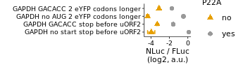

Analyze luminescent data from UL4 uORF2 mutants to create figure 6C
================

# Load libraries

``` r
library(plotrix)
library(tidyverse)
library(rasilabRtemplates)

theme_rasilab <- function() {
  theme_classic(base_family = "Helvetica", base_size = 8) +
    theme(
      strip.background = ggplot2::element_blank(),
      legend.text = element_text(size = 8),
      strip.text.x = element_text(size = 8),
      axis.line = element_line(color = "black", size=.25),
      axis.text = element_text(color = "black", size = 8)
    )
}

theme_set(theme_rasilab())
```

# Read in data

``` r
counts <- read_csv("../rawdata/20220413_fluc_nluc.csv") %>%
  print()
```

    ## # A tibble: 64 × 3
    ##    well  assay counts
    ##    <chr> <chr>  <dbl>
    ##  1 B2    fluc    1147
    ##  2 B4    fluc     833
    ##  3 B6    fluc      15
    ##  4 B8    fluc    1083
    ##  5 B10   fluc    1181
    ##  6 B12   fluc       2
    ##  7 C2    fluc    1368
    ##  8 C4    fluc    1645
    ##  9 C6    fluc    1395
    ## 10 C8    fluc    1209
    ## # … with 54 more rows
    ## # ℹ Use `print(n = ...)` to see more rows

# Read in annotations

``` r
annotations <- read_csv("../annotations/sampleannotations.csv") %>%
  print()
```

    ## # A tibble: 32 × 6
    ##    well  reporter label                             replicate P22A  label_order
    ##    <chr> <chr>    <chr>                                 <dbl> <chr>       <dbl>
    ##  1 B2    pTBHS12  GAPDH GACACC stop before uORF2            1 no              2
    ##  2 B4    pTBHS13  GAPDH GACACC stop before uORF2            1 yes             2
    ##  3 B6    pTBHS23  GAPDH no start stop before uORF2          1 no              1
    ##  4 B8    pTBHS24  GAPDH no start stop before uORF2          1 yes             1
    ##  5 B10   pTBHS58  GAPDH GACACC 2 eYFP codons longer         1 no              4
    ##  6 B12   mock     mock                                      1 <NA>           NA
    ##  7 C2    pTBHS59  GAPDH GACACC 2 eYFP codons longer         1 yes             4
    ##  8 C4    pTBHS60  GAPDH no AUG 2 eYFP codons longer         1 no              3
    ##  9 C6    pTBHS61  GAPDH no AUG 2 eYFP codons longer         1 yes             3
    ## 10 C8    pTBHS12  GAPDH GACACC stop before uORF2            2 no              2
    ## # … with 22 more rows
    ## # ℹ Use `print(n = ...)` to see more rows

# Join data with annotations, normalize NLuc by FLuc, calculate mean and error

``` r
data <- counts %>% 
  pivot_wider(names_from = assay, values_from = counts) %>%
  left_join(annotations, by = "well") %>%
  mutate(fluc = fluc - mean(fluc[reporter == "mock"]), nluc = nluc - mean(nluc[reporter == "mock"])) %>%
  filter(label != "mock") %>% 
  mutate(ratio = log2(nluc) - log2(fluc)) %>% 
  group_by(reporter) %>% 
  mutate(mean_ratio = mean(ratio), se_ratio = std.error(ratio)) %>%
  slice(1) %>% 
  ungroup() %>% 
  select(-well, -fluc, -nluc, -ratio, -replicate) %>%
  mutate(label = fct_reorder(label, label_order)) %>%
  print()
```

    ## # A tibble: 10 × 6
    ##    reporter label                             P22A  label_order mean_r…¹ se_ra…²
    ##    <chr>    <fct>                             <chr>       <dbl>    <dbl>   <dbl>
    ##  1 pTBHS12  GAPDH GACACC stop before uORF2    no              2     7.17  0.0841
    ##  2 pTBHS13  GAPDH GACACC stop before uORF2    yes             2     8.91  0.132 
    ##  3 pTBHS2   gp48UTR-no-AUG                    <NA>           NA    10.5   0.0534
    ##  4 pTBHS23  GAPDH no start stop before uORF2  no              1     6.52  0.397 
    ##  5 pTBHS24  GAPDH no start stop before uORF2  yes             1    10.6   0.0153
    ##  6 pTBHS3   gp48UTR-stronger-start            <NA>           NA     4.31  0.138 
    ##  7 pTBHS58  GAPDH GACACC 2 eYFP codons longer no              4     7.37  0.107 
    ##  8 pTBHS59  GAPDH GACACC 2 eYFP codons longer yes             4     8.77  0.0812
    ##  9 pTBHS60  GAPDH no AUG 2 eYFP codons longer no              3     6.13  0.147 
    ## 10 pTBHS61  GAPDH no AUG 2 eYFP codons longer yes             3    10.0   0.160 
    ## # … with abbreviated variable names ¹​mean_ratio, ²​se_ratio

# Plot FLuc / NLuc

``` r
plot_data <- data %>%
  mutate(mean_ratio = mean_ratio - mean_ratio[label=="gp48UTR-no-AUG"]) %>%
  filter(reporter %in% c("pTBHS12", "pTBHS13", "pTBHS23", "pTBHS24", "pTBHS58", "pTBHS59", "pTBHS60", "pTBHS61")) %>%
  print()
```

    ## # A tibble: 8 × 6
    ##   reporter label                             P22A  label_order mean_ra…¹ se_ra…²
    ##   <chr>    <fct>                             <chr>       <dbl>     <dbl>   <dbl>
    ## 1 pTBHS12  GAPDH GACACC stop before uORF2    no              2   -3.32    0.0841
    ## 2 pTBHS13  GAPDH GACACC stop before uORF2    yes             2   -1.59    0.132 
    ## 3 pTBHS23  GAPDH no start stop before uORF2  no              1   -3.98    0.397 
    ## 4 pTBHS24  GAPDH no start stop before uORF2  yes             1    0.0969  0.0153
    ## 5 pTBHS58  GAPDH GACACC 2 eYFP codons longer no              4   -3.13    0.107 
    ## 6 pTBHS59  GAPDH GACACC 2 eYFP codons longer yes             4   -1.72    0.0812
    ## 7 pTBHS60  GAPDH no AUG 2 eYFP codons longer no              3   -4.36    0.147 
    ## 8 pTBHS61  GAPDH no AUG 2 eYFP codons longer yes             3   -0.476   0.160 
    ## # … with abbreviated variable names ¹​mean_ratio, ²​se_ratio

``` r
plot_data %>%
# Plot average nluc/fluc ratios by reporter construct
 ggplot(aes(x = label, y = mean_ratio, ymax = mean_ratio + se_ratio,
            ymin = mean_ratio - se_ratio, color = P22A, shape = P22A)) +  
  geom_point(size = 2) +
  geom_errorbar(width = 0.5, show.legend = F) +
  labs(y = 'NLuc / FLuc\n(log2, a.u.)',
       x = '') +
  scale_y_continuous(breaks = scales::pretty_breaks(n=3)) +
  scale_color_manual(values = cbPalette[c(2,1)]) +
  scale_shape_manual(values=c(17, 16)) +
  coord_flip() +
  theme(axis.text.y = element_text(size = 7), axis.text.x = element_text(size = 7))
```

<!-- -->

``` r
ggsave("../figures/fig_6c.pdf")
```
