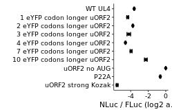

Analyze luminescent data from perturbed uORF2 d_stall mutants to create
figure 6B
================

-   <a href="#load-libraries" id="toc-load-libraries">Load libraries</a>
-   <a href="#read-in-data" id="toc-read-in-data">Read in data</a>
-   <a href="#read-in-annotations" id="toc-read-in-annotations">Read in
    annotations</a>
-   <a
    href="#join-data-with-annotations-normalize-nluc-by-fluc-calculate-mean-and-error"
    id="toc-join-data-with-annotations-normalize-nluc-by-fluc-calculate-mean-and-error">Join
    data with annotations, normalize NLuc by FLuc, calculate mean and
    error</a>
-   <a href="#plot-fluc--nluc-for-subset-samples"
    id="toc-plot-fluc--nluc-for-subset-samples">Plot Fluc / Nluc for subset
    samples</a>

# Load libraries

``` r
library(tidyverse)
library(rasilabRtemplates)
library(plotrix)

theme_rasilab <- function() {
  theme_classic(base_family = "Helvetica", base_size = 8) +
    theme(
      strip.background = ggplot2::element_blank(),
      legend.text = element_text(size = 8),
      strip.text.x = element_text(size = 8),
      axis.line = element_line(color = "black", size=.25),
      axis.text = element_text(color = "black", size = 8)
    )
}

theme_set(theme_rasilab())
```

# Read in data

``` r
counts <- read_csv("../rawdata/20190829_fluc_nluc.csv") %>%
  print()
```

    ## # A tibble: 120 × 3
    ##    well  assay  counts
    ##    <chr> <chr>   <dbl>
    ##  1 B2    nluc   557547
    ##  2 B3    nluc  4208692
    ##  3 B4    nluc  2414334
    ##  4 B5    nluc    18928
    ##  5 B6    nluc   246454
    ##  6 B7    nluc   329587
    ##  7 B8    nluc    95910
    ##  8 B9    nluc    97743
    ##  9 B10   nluc   104240
    ## 10 B11   nluc    75727
    ## # … with 110 more rows
    ## # ℹ Use `print(n = ...)` to see more rows

# Read in annotations

``` r
annotations <- read_csv("../annotations/sampleannotations.csv") %>%
  janitor::clean_names() %>% 
  print()
```

    ## # A tibble: 60 × 6
    ##    well  reporter label                              replicate p22a  label_order
    ##    <chr> <chr>    <chr>                                  <dbl> <chr>       <dbl>
    ##  1 B2    pASHS64  WT UL4                                     1 <NA>           10
    ##  2 B3    pTBHS1   P22A                                       1 <NA>            2
    ##  3 B4    pTBHS2   uORF2 no AUG                               1 <NA>            3
    ##  4 B5    pTBHS3   uORF2 strong Kozak                         1 <NA>            1
    ##  5 B6    pTBHS12  GAPDH stop before uORF2                    1 no             NA
    ##  6 B7    pTBHS13  GAPDH stop before uORF2                    1 yes            NA
    ##  7 B8    pTBHS14  1 eYFP codon longer uORF2                  1 <NA>            9
    ##  8 B9    pTBHS15  2 eYFP codons longer uORF2 (dirty)         1 <NA>           NA
    ##  9 B10   pTBHS15c 2 eYFP codons longer uORF2                 1 <NA>            8
    ## 10 B11   pTBHS16  3 eYFP codons longer uORF2                 1 <NA>            7
    ## # … with 50 more rows
    ## # ℹ Use `print(n = ...)` to see more rows

# Join data with annotations, normalize NLuc by FLuc, calculate mean and error

``` r
data <- counts %>% 
  pivot_wider(names_from = assay, values_from = counts) %>%
  left_join(annotations, by = "well") %>%
  mutate(fluc = fluc - mean(fluc[reporter == "mock"]), nluc = nluc - mean(nluc[reporter == "mock"])) %>%
  filter(fluc > 0) %>% 
  filter(label != "mock") %>%
  mutate(ratio = log2(nluc) - log2(fluc)) %>% 
  group_by(reporter) %>% 
  mutate(mean_ratio = mean(ratio), se_ratio = std.error(ratio)) %>% 
  slice(1) %>%
  ungroup() %>% 
  select(-well, -fluc, -nluc, -ratio, -replicate) %>%
  mutate(label = fct_reorder(label, label_order)) %>%
  print()
```

    ## # A tibble: 19 × 6
    ##    reporter label                              p22a  label_order mean_…¹ se_ra…²
    ##    <chr>    <fct>                              <chr>       <dbl>   <dbl>   <dbl>
    ##  1 pASHS64  WT UL4                             <NA>           10    6.06  0.0432
    ##  2 pTBHS1   P22A                               <NA>            2    9.04  0.0492
    ##  3 pTBHS12  GAPDH stop before uORF2            no             NA    6.52  0.0295
    ##  4 pTBHS13  GAPDH stop before uORF2            yes            NA    7.96  0.104 
    ##  5 pTBHS14  1 eYFP codon longer uORF2          <NA>            9    5.32  0.106 
    ##  6 pTBHS15  2 eYFP codons longer uORF2 (dirty) <NA>           NA    5.79  0.0601
    ##  7 pTBHS15c 2 eYFP codons longer uORF2         <NA>            8    5.91  0.0444
    ##  8 pTBHS16  3 eYFP codons longer uORF2         <NA>            7    5.45  0.204 
    ##  9 pTBHS17  4 eYFP codons longer uORF2         <NA>            6    5.07  0.0333
    ## 10 pTBHS18  GC52                               <NA>           NA    4.94  0.0640
    ## 11 pTBHS19  GC62                               <NA>           NA    5.24  0.116 
    ## 12 pTBHS2   uORF2 no AUG                       <NA>            3    9.67  0.0122
    ## 13 pTBHS20  GC78                               <NA>           NA    4.25  0.117 
    ## 14 pTBHS22  CAA repeat                         <NA>           NA    3.73  0.0667
    ## 15 pTBHS23  GAPDH no start stop before uORF2   no             NA    4.71  0.186 
    ## 16 pTBHS24  GAPDH no start stop before uORF2   yes            NA    9.66  0.0230
    ## 17 pTBHS25  7 eYFP codons longer uORF2         <NA>            5    5.71  0.113 
    ## 18 pTBHS26  10 eYFP codons longer uORF2        <NA>            4    7.39  0.158 
    ## 19 pTBHS3   uORF2 strong Kozak                 <NA>            1    4.11  0.0957
    ## # … with abbreviated variable names ¹​mean_ratio, ²​se_ratio

# Plot Fluc / Nluc for subset samples

``` r
plot_data <- data %>%
  # select only reporters of interest
  filter(!is.na(label_order)) %>% 
  mutate(mean_ratio = mean_ratio - max(mean_ratio)) %>%
  print()
```

    ## # A tibble: 10 × 6
    ##    reporter label                       p22a  label_order mean_ratio se_ratio
    ##    <chr>    <fct>                       <chr>       <dbl>      <dbl>    <dbl>
    ##  1 pASHS64  WT UL4                      <NA>           10     -3.61    0.0432
    ##  2 pTBHS1   P22A                        <NA>            2     -0.623   0.0492
    ##  3 pTBHS14  1 eYFP codon longer uORF2   <NA>            9     -4.34    0.106 
    ##  4 pTBHS15c 2 eYFP codons longer uORF2  <NA>            8     -3.76    0.0444
    ##  5 pTBHS16  3 eYFP codons longer uORF2  <NA>            7     -4.22    0.204 
    ##  6 pTBHS17  4 eYFP codons longer uORF2  <NA>            6     -4.60    0.0333
    ##  7 pTBHS2   uORF2 no AUG                <NA>            3      0       0.0122
    ##  8 pTBHS25  7 eYFP codons longer uORF2  <NA>            5     -3.96    0.113 
    ##  9 pTBHS26  10 eYFP codons longer uORF2 <NA>            4     -2.27    0.158 
    ## 10 pTBHS3   uORF2 strong Kozak          <NA>            1     -5.55    0.0957

``` r
plot_data %>%
# Plot average nluc/fluc ratios by reporter construct
 ggplot(aes(y = label, x = mean_ratio, xmax = mean_ratio + se_ratio,
            xmin = mean_ratio - se_ratio)) +
  geom_point(size = 1) +
  geom_errorbar(width = 0.5, show.legend = F) +
  labs(x = 'NLuc / FLuc (log2 a.u.)', y = '', color = '') +
  scale_x_continuous(breaks = scales::pretty_breaks(n=4)) +
  theme(panel.grid = element_blank(), axis.text.y = element_text(size = 7), axis.text.x = element_text(size = 7))
```

<!-- -->

``` r
ggsave("../figures/fig_6b.pdf")
```
