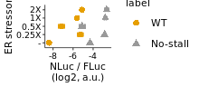
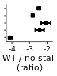

Analyze luminescent data from UL4 uORF2 mutants to create figure 5B
================

# Load libraries

``` r
library(plotrix)
library(tidyverse)
library(rasilabRtemplates)

theme_rasilab <- function() {
  theme_classic(base_family = "Helvetica", base_size = 8) +
    theme(
      strip.background = ggplot2::element_blank(),
      legend.text = element_text(size = 8),
      strip.text.x = element_text(size = 8),
      axis.line = element_line(color = "black", size=.25),
      axis.text = element_text(color = "black", size = 8)
    )
}

theme_set(theme_rasilab())
```

# Read in data

``` r
counts <- read_csv("../rawdata/20220612_fluc_nluc.csv") %>%
  print()
```

    ## # A tibble: 88 × 3
    ##    well  assay counts
    ##    <chr> <chr>  <dbl>
    ##  1 B1    fluc       4
    ##  2 B2    fluc    2050
    ##  3 B3    fluc    4310
    ##  4 B4    fluc    4317
    ##  5 B5    fluc    5406
    ##  6 B6    fluc     681
    ##  7 B7    fluc    2268
    ##  8 B8    fluc    3490
    ##  9 B9    fluc    7808
    ## 10 B10   fluc    3461
    ## # … with 78 more rows
    ## # ℹ Use `print(n = ...)` to see more rows

# Read in annotations

``` r
annotations <- read_csv("../annotations/sampleannotations.csv") %>%
  print()
```

    ## # A tibble: 44 × 6
    ##    well  reporter label    replicate status label_order
    ##    <chr> <chr>    <chr>        <dbl> <chr>        <dbl>
    ##  1 B1    mock     mock             1 <NA>            NA
    ##  2 B2    pTBHS134 WT               1 -                1
    ##  3 B3    pTBHS135 No-stall         1 -                1
    ##  4 B4    pTBHS134 WT               1 0.25X            2
    ##  5 B5    pTBHS135 No-stall         1 0.25X            2
    ##  6 B6    pTBHS134 WT               1 0.5X             3
    ##  7 B7    pTBHS135 No-stall         1 0.5X             3
    ##  8 B8    pTBHS134 WT               1 1X               4
    ##  9 B9    pTBHS135 No-stall         1 1X               4
    ## 10 B10   pTBHS134 WT               1 2X               5
    ## # … with 34 more rows
    ## # ℹ Use `print(n = ...)` to see more rows

# Join data with annotations, normalize NLuc by FLuc, calculate mean and error

``` r
data <- counts %>% 
  pivot_wider(names_from = assay, values_from = counts) %>%
  left_join(annotations, by = "well") %>%
  mutate(fluc = fluc - mean(fluc[reporter == "mock"]), nluc = nluc - mean(nluc[reporter == "mock"])) %>%
  filter(label != "mock") %>%
  filter(fluc > 0) %>%
  mutate(ratio = log2(nluc) - log2(fluc)) %>% 
  group_by(reporter, status) %>% 
  mutate(mean_ratio = mean(ratio), se_ratio = std.error(ratio)) %>% 
  ungroup() %>%
  select(-well, -fluc, -nluc, -replicate) %>%
  #mutate(label = fct_rev(fct_reorder(label, label_order))) %>%
  print()
```

    ## # A tibble: 40 × 7
    ##    reporter label    status label_order ratio mean_ratio se_ratio
    ##    <chr>    <chr>    <chr>        <dbl> <dbl>      <dbl>    <dbl>
    ##  1 pTBHS134 WT       -                1  1.21       1.09   0.106 
    ##  2 pTBHS135 No-stall -                1  5.23       5.19   0.0885
    ##  3 pTBHS134 WT       0.25X            2  3.81       4.21   0.247 
    ##  4 pTBHS135 No-stall 0.25X            2  6.77       6.63   0.0852
    ##  5 pTBHS134 WT       0.5X             3  2.85       2.33   0.267 
    ##  6 pTBHS135 No-stall 0.5X             3  4.80       4.39   0.274 
    ##  7 pTBHS134 WT       1X               4  4.02       3.89   0.0741
    ##  8 pTBHS135 No-stall 1X               4  6.75       6.71   0.0961
    ##  9 pTBHS134 WT       2X               5  4.36       4.38   0.0851
    ## 10 pTBHS135 No-stall 2X               5  7.26       6.84   0.165 
    ## # … with 30 more rows
    ## # ℹ Use `print(n = ...)` to see more rows

# Import uORF2 mutant data for normalization

``` r
norm_data <- read_csv("../../platform_controls/tables/nluc_fluc_control_mutants_not_normalized.csv") %>%
  filter(label == "gp48UTR-no-AUG") %>%
  print()
```

    ## # A tibble: 3 × 6
    ##   reporter label          label_order ratio mean_ratio se_ratio
    ##   <chr>    <chr>                <dbl> <dbl>      <dbl>    <dbl>
    ## 1 pTBHS2   gp48UTR-no-AUG           6  9.08       9.49    0.204
    ## 2 pTBHS2   gp48UTR-no-AUG           6  9.74       9.49    0.204
    ## 3 pTBHS2   gp48UTR-no-AUG           6  9.63       9.49    0.204

# Plot FLuc / NLuc for drug treatment

``` r
plot_data <- data %>%
  mutate(mean_ratio = mean_ratio - norm_data$mean_ratio) %>%
  print()
```

    ## # A tibble: 40 × 7
    ##    reporter label    status label_order ratio mean_ratio se_ratio
    ##    <chr>    <chr>    <chr>        <dbl> <dbl>      <dbl>    <dbl>
    ##  1 pTBHS134 WT       -                1  1.21      -8.39   0.106 
    ##  2 pTBHS135 No-stall -                1  5.23      -4.30   0.0885
    ##  3 pTBHS134 WT       0.25X            2  3.81      -5.28   0.247 
    ##  4 pTBHS135 No-stall 0.25X            2  6.77      -2.85   0.0852
    ##  5 pTBHS134 WT       0.5X             3  2.85      -7.16   0.267 
    ##  6 pTBHS135 No-stall 0.5X             3  4.80      -5.09   0.274 
    ##  7 pTBHS134 WT       1X               4  4.02      -5.60   0.0741
    ##  8 pTBHS135 No-stall 1X               4  6.75      -2.78   0.0961
    ##  9 pTBHS134 WT       2X               5  4.36      -5.11   0.0851
    ## 10 pTBHS135 No-stall 2X               5  7.26      -2.65   0.165 
    ## # … with 30 more rows
    ## # ℹ Use `print(n = ...)` to see more rows

``` r
plot_data$label <- factor(plot_data$label, levels = c("WT", "No-stall"))

plot_data %>%
# Plot average nluc/fluc ratios by reporter construct
 ggplot(aes(x = status, y = mean_ratio, ymax = mean_ratio + se_ratio,
            ymin = mean_ratio - se_ratio, color = label, shape = label)) +  
  geom_point(size = 2) +
  geom_errorbar(width = 0.5, show.legend = F) +
  labs(y = 'NLuc / FLuc\n(log2, a.u.)',
       x = 'ER stressor') +
  scale_y_continuous(breaks = scales::pretty_breaks(n=3)) +
  coord_flip() +
  theme(axis.text.y = element_text(size = 7), axis.text.x = element_text(size = 7)) +
  scale_color_manual(values = cbPalette[c(2,1)])
```

<!-- -->

``` r
ggsave("../figures/fig_5b_left.pdf")
```

# Plot FLuc / NLuc for drug treatment, normalized

``` r
plot_data <- data %>%
  #mutate(mean_ratio = mean_ratio - norm_data$mean_ratio) %>%
  group_by(status) %>%
  mutate(mean_ratio = mean_ratio - mean_ratio[label=="No-stall"]) %>%
  ungroup() %>%
  filter(label == 'WT') %>%
  print()
```

    ## # A tibble: 20 × 7
    ##    reporter label status label_order ratio mean_ratio se_ratio
    ##    <chr>    <chr> <chr>        <dbl> <dbl>      <dbl>    <dbl>
    ##  1 pTBHS134 WT    -                1 1.21       -4.09   0.106 
    ##  2 pTBHS134 WT    0.25X            2 3.81       -2.42   0.247 
    ##  3 pTBHS134 WT    0.5X             3 2.85       -2.06   0.267 
    ##  4 pTBHS134 WT    1X               4 4.02       -2.82   0.0741
    ##  5 pTBHS134 WT    2X               5 4.36       -2.46   0.0851
    ##  6 pTBHS134 WT    -                1 0.779      -4.09   0.106 
    ##  7 pTBHS134 WT    0.25X            2 4.83       -2.42   0.247 
    ##  8 pTBHS134 WT    0.5X             3 2.69       -2.06   0.267 
    ##  9 pTBHS134 WT    1X               4 3.99       -2.82   0.0741
    ## 10 pTBHS134 WT    2X               5 4.62       -2.46   0.0851
    ## 11 pTBHS134 WT    -                1 1.24       -4.09   0.106 
    ## 12 pTBHS134 WT    0.25X            2 4.39       -2.42   0.247 
    ## 13 pTBHS134 WT    0.5X             3 2.09       -2.06   0.267 
    ## 14 pTBHS134 WT    1X               4 3.69       -2.82   0.0741
    ## 15 pTBHS134 WT    2X               5 4.25       -2.46   0.0851
    ## 16 pTBHS134 WT    -                1 1.15       -4.09   0.106 
    ## 17 pTBHS134 WT    0.25X            2 3.81       -2.42   0.247 
    ## 18 pTBHS134 WT    0.5X             3 1.70       -2.06   0.267 
    ## 19 pTBHS134 WT    1X               4 3.85       -2.82   0.0741
    ## 20 pTBHS134 WT    2X               5 4.27       -2.46   0.0851

``` r
plot_data %>%
# Plot average nluc/fluc ratios by reporter construct
 ggplot(aes(x = status, y = mean_ratio, ymax = mean_ratio + se_ratio,
            ymin = mean_ratio - se_ratio)) +  
  geom_point(size = 1) +
  geom_errorbar(width = 0.5, show.legend = F) +
  labs(y = 'WT / no stall\n(ratio)',
       x = '') +
  scale_y_continuous(breaks = scales::pretty_breaks(n=2)) +
  scale_color_manual(values = cbPalette[c(2,1)]) +
  coord_flip() +
  theme(axis.text.y = element_blank(), axis.text.x = element_text(size = 7), axis.title.y = element_blank())
```

<!-- -->

``` r
ggsave("../figures/fig_5b_right.pdf")
```

# Conclusions

-   
