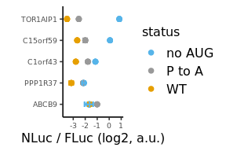

Analyze luminescent data from UL4 uORF2 mutants to create figure 7
================

# Load libraries

``` r
library(plotrix)
library(tidyverse)
library(rasilabRtemplates)
```

# Read in data

``` r
counts <- read_csv("../rawdata/20220415_fluc_nluc.csv") %>%
  print()
```

    ## # A tibble: 174 × 3
    ##    well  assay counts
    ##    <chr> <chr>  <dbl>
    ##  1 A1    fluc    2573
    ##  2 A2    fluc    1577
    ##  3 A3    fluc    2388
    ##  4 A4    fluc    1096
    ##  5 A5    fluc    2660
    ##  6 A6    fluc    1743
    ##  7 A7    fluc     813
    ##  8 A8    fluc    2490
    ##  9 A9    fluc    1140
    ## 10 A10   fluc    3225
    ## # … with 164 more rows
    ## # ℹ Use `print(n = ...)` to see more rows

# Read in annotations

``` r
annotations <- read_csv("../annotations/sampleannotations.csv") %>%
  print()
```

    ## # A tibble: 87 × 6
    ##    well  reporter label    replicate status label_order
    ##    <chr> <chr>    <chr>        <dbl> <chr>        <dbl>
    ##  1 A1    pTBHS79  C1orf43          1 WT               3
    ##  2 A2    pTBHS83  TOR1AIP1         1 WT               1
    ##  3 A3    pTBHS86  C15orf59         1 WT               2
    ##  4 A4    pTBHS87  PPP1R37          1 WT               4
    ##  5 A5    pTBHS89  ABCB9            1 WT               5
    ##  6 A6    pTBHS91  C1orf43          1 P to A           3
    ##  7 A7    pTBHS95  TOR1AIP1         1 P to A           1
    ##  8 A8    pTBHS98  C15orf59         1 P to A           2
    ##  9 A9    pTBHS99  PPP1R37          1 P to A           4
    ## 10 A10   pTBHS101 ABCB9            1 P to A           5
    ## # … with 77 more rows
    ## # ℹ Use `print(n = ...)` to see more rows

# Join data with annotations, normalize NLuc by FLuc, calculate mean and error

``` r
data <- counts %>% 
  pivot_wider(names_from = assay, values_from = counts) %>%
  left_join(annotations, by = "well") %>%
  mutate(fluc = fluc - mean(fluc[reporter == "mock"]), nluc = nluc - mean(nluc[reporter == "mock"])) %>%
  filter(label != "mock") %>%
  mutate(ratio = log2(nluc) - log2(fluc)) %>% 
  group_by(reporter) %>% 
  mutate(mean_ratio = mean(ratio), se_ratio = std.error(ratio)) %>% 
  ungroup() %>% 
  select(-well, -fluc, -nluc, -replicate) %>%
  mutate(label = fct_rev(fct_reorder(label, label_order))) %>%
  print()
```

    ## # A tibble: 83 × 7
    ##    reporter label    status label_order ratio mean_ratio se_ratio
    ##    <chr>    <fct>    <chr>        <dbl> <dbl>      <dbl>    <dbl>
    ##  1 pTBHS79  C1orf43  WT               3  7.34       7.49   0.0566
    ##  2 pTBHS83  TOR1AIP1 WT               1  6.46       6.76   0.118 
    ##  3 pTBHS86  C15orf59 WT               2  7.57       7.61   0.0656
    ##  4 pTBHS87  PPP1R37  WT               4  6.82       7.11   0.164 
    ##  5 pTBHS89  ABCB9    WT               5  8.21       8.64   0.143 
    ##  6 pTBHS91  C1orf43  P to A           3  8.34       8.49   0.113 
    ##  7 pTBHS95  TOR1AIP1 P to A           1  7.40       7.74   0.108 
    ##  8 pTBHS98  C15orf59 P to A           2  8.41       8.28   0.167 
    ##  9 pTBHS99  PPP1R37  P to A           4  7.79       8.09   0.0799
    ## 10 pTBHS101 ABCB9    P to A           5  9.20       9.26   0.0503
    ## # … with 73 more rows
    ## # ℹ Use `print(n = ...)` to see more rows

# Plot FLuc / NLuc

``` r
plot_data <- data %>%
  mutate(mean_ratio = mean_ratio - mean_ratio[label=="gp48UTR-no-AUG"]) %>%
  filter(!reporter %in% c("pASHS64", "pTBHS1", "pTBHS2", "pTBHS3")) %>%
  print()
```

    ## # A tibble: 75 × 7
    ##    reporter label    status label_order ratio mean_ratio se_ratio
    ##    <chr>    <fct>    <chr>        <dbl> <dbl>      <dbl>    <dbl>
    ##  1 pTBHS79  C1orf43  WT               3  7.34      -2.78   0.0566
    ##  2 pTBHS83  TOR1AIP1 WT               1  6.46      -3.52   0.118 
    ##  3 pTBHS86  C15orf59 WT               2  7.57      -2.67   0.0656
    ##  4 pTBHS87  PPP1R37  WT               4  6.82      -3.16   0.164 
    ##  5 pTBHS89  ABCB9    WT               5  8.21      -1.63   0.143 
    ##  6 pTBHS91  C1orf43  P to A           3  8.34      -1.78   0.113 
    ##  7 pTBHS95  TOR1AIP1 P to A           1  7.40      -2.53   0.108 
    ##  8 pTBHS98  C15orf59 P to A           2  8.41      -2.00   0.167 
    ##  9 pTBHS99  PPP1R37  P to A           4  7.79      -2.18   0.0799
    ## 10 pTBHS101 ABCB9    P to A           5  9.20      -1.01   0.0503
    ## # … with 65 more rows
    ## # ℹ Use `print(n = ...)` to see more rows

``` r
plot_data %>%
# Plot average nluc/fluc ratios by reporter construct
 ggplot(aes(x = label, y = mean_ratio, ymax = mean_ratio + se_ratio,
            ymin = mean_ratio - se_ratio, color = status)) +  
  geom_point(size = 2) +
  geom_errorbar(width = 0.25, show.legend = F) +
  labs(y = 'NLuc / FLuc (log2, a.u.)',
       x = '') +
  scale_y_continuous(breaks = scales::pretty_breaks(n=4)) +
  scale_color_manual(values = cbPalette[c(3,1,2)]) +
  coord_flip() +
  theme(axis.text.y = element_text(size = 7), axis.text.x = element_text(size = 7))
```

<!-- -->

``` r
ggsave("../figures/fig_7.pdf")
```

# Calculate p-values for WT vs no AUG

``` r
data %>% 
  filter(!is.na(label_order)) %>% 
  filter(status %in% c("WT", "no AUG")) %>% 
  group_by(label) %>% 
  nest() %>%
  mutate(ttest = map(data, function(df) t.test(ratio ~ status, df) %>% broom::tidy())) %>% 
  unnest(ttest) %>% 
  select(-data, -matches("estimate|conf")) %>% 
  mutate(p.value = round(p.value, 4)) %>% 
  knitr::kable()
```

| label    |  statistic | p.value | parameter | method                  | alternative |
|:---------|-----------:|--------:|----------:|:------------------------|:------------|
| C1orf43  | 14.4605625 |  0.0000 |  6.409680 | Welch Two Sample t-test | two.sided   |
| TOR1AIP1 | 27.9776257 |  0.0000 |  7.813183 | Welch Two Sample t-test | two.sided   |
| C15orf59 | 26.9106471 |  0.0000 |  7.780189 | Welch Two Sample t-test | two.sided   |
| PPP1R37  |  5.3459027 |  0.0011 |  6.873574 | Welch Two Sample t-test | two.sided   |
| ABCB9    | -0.2001359 |  0.8489 |  5.228384 | Welch Two Sample t-test | two.sided   |

# Calculate p-values for WT vs P to A

``` r
data %>% 
  filter(!is.na(label_order)) %>% 
  filter(status %in% c("WT", "P to A")) %>% 
  group_by(label) %>% 
  nest() %>%
  mutate(ttest = map(data, function(df) t.test(ratio ~ status, df) %>% broom::tidy())) %>% 
  unnest(ttest) %>% 
  select(-data, -matches("estimate|conf")) %>% 
  mutate(p.value = round(p.value, 4)) %>% 
  knitr::kable()
```

| label    | statistic | p.value | parameter | method                  | alternative |
|:---------|----------:|--------:|----------:|:------------------------|:------------|
| C1orf43  |  7.954629 |  0.0002 |  5.889350 | Welch Two Sample t-test | two.sided   |
| TOR1AIP1 |  6.122729 |  0.0003 |  7.933125 | Welch Two Sample t-test | two.sided   |
| C15orf59 |  3.743598 |  0.0124 |  5.210273 | Welch Two Sample t-test | two.sided   |
| PPP1R37  |  5.385190 |  0.0019 |  5.801095 | Welch Two Sample t-test | two.sided   |
| ABCB9    |  4.099926 |  0.0094 |  4.980103 | Welch Two Sample t-test | two.sided   |
