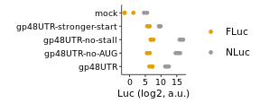
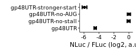

Analyze luminescent data from UL4 uORF2 control mutants to create
figures 2C and S1B
================

# Load libraries

``` r
library(plotrix)
library(tidyverse)
library(rasilabRtemplates)
```

# Read in data

``` r
counts <- read_csv("../rawdata/20190422_fluc_nluc.csv") %>% 
  print()
```

    ## # A tibble: 72 × 3
    ##    well  assay counts
    ##    <chr> <chr>  <dbl>
    ##  1 E2    fluc       1
    ##  2 F2    fluc      -1
    ##  3 G2    fluc       3
    ##  4 E12   fluc       0
    ##  5 F12   fluc       1
    ##  6 G12   fluc       0
    ##  7 E2    nluc     228
    ##  8 F2    nluc     205
    ##  9 G2    nluc     180
    ## 10 E12   nluc     171
    ## # … with 62 more rows
    ## # ℹ Use `print(n = ...)` to see more rows

# Read in annotations

``` r
annotations <- read_csv("../annotations/sampleannotations.csv") %>% 
  print()
```

    ## # A tibble: 36 × 5
    ##    well  reporter label                      replicate label_order
    ##    <chr> <chr>    <chr>                          <dbl>       <dbl>
    ##  1 B2    pPBHS123 SV40-no-Nluc                       1          NA
    ##  2 B3    pPBHS124 SV40                               1           2
    ##  3 B4    pASHS62  Base                               1           1
    ##  4 B5    pASHS63  GAPDH-frag-no-stop-gp48UTR         1           8
    ##  5 B6    pASHS64  gp48UTR                            1           4
    ##  6 B7    pASHS65  GAPDH-frag                         1           3
    ##  7 B8    pTBHS1   gp48UTR-no-stall                   1           5
    ##  8 B9    pTBHS2   gp48UTR-no-AUG                     1           6
    ##  9 B10   pTBHS3   gp48UTR-stronger-start             1           7
    ## 10 B11   pTBHS4   GAPDH-frag-stop-gp48UTR            1           9
    ## # … with 26 more rows
    ## # ℹ Use `print(n = ...)` to see more rows

# Join data with annotations, normalize NLuc by FLuc, calculate mean and error

``` r
data <- counts %>% 
  pivot_wider(names_from = assay, values_from = counts) %>%
  left_join(annotations, by = "well") %>%
  mutate(fluc = fluc - mean(fluc[reporter == "mock"]), nluc = nluc - mean(nluc[reporter == "mock"])) %>%
  write_csv("../tables/raw_nluc_fluc.csv") %>%
  filter(label != "mock") %>% 
  mutate(ratio = log2(nluc) - log2(fluc)) %>% 
  group_by(reporter) %>% 
  mutate(mean_ratio = mean(ratio), se_ratio = std.error(ratio)) %>%
  #slice(1) %>% 
  ungroup() %>% 
  select(-well, -fluc, -nluc, -replicate) %>%
  mutate(label = fct_reorder(label, label_order)) %>%
  print()
```

    ## # A tibble: 30 × 6
    ##    reporter label                      label_order  ratio mean_ratio se_ratio
    ##    <chr>    <fct>                            <dbl>  <dbl>      <dbl>    <dbl>
    ##  1 pPBHS123 SV40-no-Nluc                        NA NaN        NaN     NA     
    ##  2 pPBHS124 SV40                                 2  11.1       11.1    0.275 
    ##  3 pASHS62  Base                                 1   8.16       8.32   0.168 
    ##  4 pASHS63  GAPDH-frag-no-stop-gp48UTR           8   5.42       5.84   0.243 
    ##  5 pASHS64  gp48UTR                              4   5.03       4.99   0.173 
    ##  6 pASHS65  GAPDH-frag                           3   8.00       8.42   0.213 
    ##  7 pTBHS1   gp48UTR-no-stall                     5   9.43       9.45   0.208 
    ##  8 pTBHS2   gp48UTR-no-AUG                       6   9.08       9.49   0.204 
    ##  9 pTBHS3   gp48UTR-stronger-start               7   2.94       3.55   0.315 
    ## 10 pTBHS4   GAPDH-frag-stop-gp48UTR              9   7.58       7.44   0.0732
    ## # … with 20 more rows
    ## # ℹ Use `print(n = ...)` to see more rows

# Plot FLuc, NLuc raw values

``` r
raw_plot_data <- read_csv("../tables/raw_nluc_fluc.csv") %>%
  filter(str_detect(reporter, "pASHS64|pTBHS[123]|mock")) %>%
  select(-label_order, -replicate, -reporter, -well) %>%
  rename(FLuc = fluc, NLuc = nluc) %>%
  pivot_longer(!label, names_to = "luc", values_to = "count") %>%
  print()
```

    ## # A tibble: 36 × 3
    ##    label luc     count
    ##    <chr> <chr>   <dbl>
    ##  1 mock  FLuc    0.333
    ##  2 mock  NLuc   47.5  
    ##  3 mock  FLuc   -1.67 
    ##  4 mock  NLuc   24.5  
    ##  5 mock  FLuc    2.33 
    ##  6 mock  NLuc   -0.5  
    ##  7 mock  FLuc   -0.667
    ##  8 mock  NLuc   -9.5  
    ##  9 mock  FLuc    0.333
    ## 10 mock  NLuc  -14.5  
    ## # … with 26 more rows
    ## # ℹ Use `print(n = ...)` to see more rows

``` r
raw_plot_data %>%
 #Plot raw nluc, fluc by reporter construct
 ggplot(aes(x = label, y = log2(count), color = luc)) +
  geom_point(size = 1) +
  labs(y = 'Luc (log2, a.u.)',
       x = '') +
  scale_y_continuous(breaks = scales::pretty_breaks(n=4)) +
  scale_color_manual(values = cbPalette[c(2,1)]) +
  coord_flip() +
  theme(axis.text.y = element_text(size = 7), axis.text.x = element_text(size = 7), legend.title = element_blank())
```

<!-- -->

``` r
ggsave("../figures/fig_s1b.pdf")
```

# Plot FLuc / NLuc

``` r
plot_data <- data %>%
  # select only reporters of interest
  filter(str_detect(reporter, "pASHS64|pTBHS[123]")) %>%
  # export control mutant data to normalize 4er1cat to before max normalizing
  write_csv("../tables/nluc_fluc_control_mutants_not_normalized.csv") %>%
  mutate(mean_ratio = mean_ratio - max(mean_ratio)) %>% 
  print()
```

    ## # A tibble: 12 × 6
    ##    reporter label                  label_order ratio mean_ratio se_ratio
    ##    <chr>    <fct>                        <dbl> <dbl>      <dbl>    <dbl>
    ##  1 pASHS64  gp48UTR                          4  5.03    -4.49      0.173
    ##  2 pTBHS1   gp48UTR-no-stall                 5  9.43    -0.0357    0.208
    ##  3 pTBHS2   gp48UTR-no-AUG                   6  9.08     0         0.204
    ##  4 pTBHS3   gp48UTR-stronger-start           7  2.94    -5.93      0.315
    ##  5 pTBHS3   gp48UTR-stronger-start           7  4.00    -5.93      0.315
    ##  6 pTBHS2   gp48UTR-no-AUG                   6  9.74     0         0.204
    ##  7 pTBHS1   gp48UTR-no-stall                 5  9.82    -0.0357    0.208
    ##  8 pASHS64  gp48UTR                          4  5.27    -4.49      0.173
    ##  9 pASHS64  gp48UTR                          4  4.67    -4.49      0.173
    ## 10 pTBHS1   gp48UTR-no-stall                 5  9.10    -0.0357    0.208
    ## 11 pTBHS2   gp48UTR-no-AUG                   6  9.63     0         0.204
    ## 12 pTBHS3   gp48UTR-stronger-start           7  3.72    -5.93      0.315

``` r
plot_data %>% 
  mutate_if(is.numeric, . %>% round(2)) %>% 
  write_csv("../tables/nluc_fluc_control_mutants.csv")

plot_data %>%
# Plot average nluc/fluc ratios by reporter construct
 ggplot(aes(x = label, y = mean_ratio, ymax = mean_ratio + se_ratio,
            ymin = mean_ratio - se_ratio)) +  
  geom_point(size = 1) +
  geom_errorbar(width = 0.5) +
  labs(y = 'NLuc / FLuc (log2, a.u.)',
       x = '') +
  scale_y_continuous(breaks = scales::pretty_breaks(n=4)) +
  coord_flip() +
  theme(axis.text.y = element_text(size = 7), axis.text.x = element_text(size = 7))
```

<!-- -->

``` r
ggsave("../figures/fig_2c.pdf")
```
