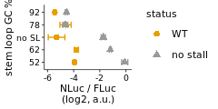
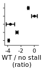

Analyze luminescent data to create figure 5A
================

# Load libraries

``` r
library(tidyverse)
library(rasilabRtemplates)
library(plotrix)

theme_rasilab <- function() {
  theme_classic(base_family = "Helvetica", base_size = 8) +
    theme(
      strip.background = ggplot2::element_blank(),
      legend.text = element_text(size = 8),
      strip.text.x = element_text(size = 8),
      axis.line = element_line(color = "black", size=.25),
      axis.text = element_text(color = "black", size = 8)
    )
}

theme_set(theme_rasilab())
```

# Read in data

``` r
counts <- read_tsv("../rawdata/20191223_fluc_nluc.tsv") %>%
  print()
```

    ## # A tibble: 108 × 3
    ##    well  assay counts
    ##    <chr> <chr>  <dbl>
    ##  1 B2    fluc       2
    ##  2 B3    fluc    1242
    ##  3 B4    fluc     610
    ##  4 B5    fluc     761
    ##  5 B6    fluc     486
    ##  6 B7    fluc      52
    ##  7 B8    fluc     285
    ##  8 B9    fluc      42
    ##  9 B10   fluc     642
    ## 10 C2    fluc     885
    ## # … with 98 more rows
    ## # ℹ Use `print(n = ...)` to see more rows

# Read in annotationsl

``` r
annotations <- read_tsv("../annotations/sampleannotations.tsv") %>%
  print()
```

    ## # A tibble: 54 × 7
    ##    well  reporter label              replicate status label_order status_order
    ##    <chr> <chr>    <chr>                  <dbl> <chr>        <dbl>        <dbl>
    ##  1 B2    mock     mock                       1 <NA>             0           NA
    ##  2 B3    pASHS64  WT UL4                     1 <NA>             1           NA
    ##  3 B4    pTBHS1   P22A                       1 <NA>             2           NA
    ##  4 B5    pTBHS2   uORF2 no AUG               1 <NA>             3           NA
    ##  5 B6    pTBHS3   uORF2 strong Kozak         1 <NA>             4           NA
    ##  6 B7    pTBHS18  GC52                       1 WT              11            1
    ##  7 B8    pTBHS19  GC62                       1 WT              12            1
    ##  8 B9    pTBHS20  GC78                       1 WT              14            1
    ##  9 B10   pTBHS21  GC92                       1 WT              15            1
    ## 10 C10   mock     mock                       2 <NA>             0           NA
    ## # … with 44 more rows
    ## # ℹ Use `print(n = ...)` to see more rows

# Join data with annotations, normalize NLuc by FLuc, calculate mean and error

``` r
data <- counts %>% 
  pivot_wider(names_from = assay, values_from = counts) %>%
  left_join(annotations, by = "well") %>%
  mutate(fluc = fluc - mean(fluc[reporter == "mock"]), nluc = nluc - mean(nluc[reporter == "mock"])) %>%
  filter(label != "mock") %>% 
  mutate(ratio = log2(nluc) - log2(fluc)) %>% 
  group_by(reporter) %>% 
  mutate(mean_ratio = mean(ratio), se_ratio = std.error(ratio)) %>% 
  slice(1) %>% 
  ungroup() %>% 
  select(-well, -fluc, -nluc, -ratio, -replicate) %>%
  arrange(desc(status)) %>% 
  mutate(label = str_replace(label, "GC", "")) %>% 
  mutate(label = str_replace(label, "CAA repeat", "no SL")) %>% 
  mutate(label = fct_reorder(label, label_order)) %>%
  mutate(status = fct_reorder(status, status_order)) %>%
  print()
```

    ## # A tibble: 16 × 7
    ##    reporter label                     status   label_o…¹ statu…² mean_…³ se_ra…⁴
    ##    <chr>    <fct>                     <fct>        <dbl>   <dbl>   <dbl>   <dbl>
    ##  1 pTBHS18  52                        WT              11       1    6.53  0.0955
    ##  2 pTBHS19  62                        WT              12       1    6.67  0.161 
    ##  3 pTBHS20  78                        WT              14       1    5.85  0.431 
    ##  4 pTBHS21  92                        WT              15       1    5.01  0.0988
    ##  5 pTBHS22  no SL                     WT              13       1    5.16  0.637 
    ##  6 pTBHS35  52                        no stall        11       2   10.4   0.236 
    ##  7 pTBHS36  62                        no stall        12       2    9.27  0.0802
    ##  8 pTBHS37  78                        no stall        14       2    5.82  0.192 
    ##  9 pTBHS38  92                        no stall        15       2    5.91  0.0904
    ## 10 pTBHS39  no SL                     no stall        13       2    8.74  0.165 
    ## 11 pASHS64  WT UL4                    <NA>             1      NA    6.05  0.304 
    ## 12 pTBHS1   P22A                      <NA>             2      NA   10.1   0.153 
    ## 13 pTBHS2   uORF2 no AUG              <NA>             3      NA   10.5   0.0936
    ## 14 pTBHS3   uORF2 strong Kozak        <NA>             4      NA    4.54  0.301 
    ## 15 pTBHS53  GAPDH strong uORF2        <NA>             6      NA    5.85  0.269 
    ## 16 pTBHS54  GAPDH no AUG strong uORF2 <NA>             5      NA    3.06  0.313 
    ## # … with abbreviated variable names ¹​label_order, ²​status_order, ³​mean_ratio,
    ## #   ⁴​se_ratio

# Plot Fluc / Nluc

``` r
plot_data <- data %>%
  mutate(mean_ratio = mean_ratio - max(mean_ratio)) %>%
  filter(!is.na(status)) %>% 
  print()
```

    ## # A tibble: 10 × 7
    ##    reporter label status   label_order status_order mean_ratio se_ratio
    ##    <chr>    <fct> <fct>          <dbl>        <dbl>      <dbl>    <dbl>
    ##  1 pTBHS18  52    WT                11            1    -3.94     0.0955
    ##  2 pTBHS19  62    WT                12            1    -3.79     0.161 
    ##  3 pTBHS20  78    WT                14            1    -4.62     0.431 
    ##  4 pTBHS21  92    WT                15            1    -5.45     0.0988
    ##  5 pTBHS22  no SL WT                13            1    -5.31     0.637 
    ##  6 pTBHS35  52    no stall          11            2    -0.0904   0.236 
    ##  7 pTBHS36  62    no stall          12            2    -1.19     0.0802
    ##  8 pTBHS37  78    no stall          14            2    -4.65     0.192 
    ##  9 pTBHS38  92    no stall          15            2    -4.55     0.0904
    ## 10 pTBHS39  no SL no stall          13            2    -1.73     0.165

``` r
plot_data %>%
# Plot average nluc/fluc ratios by reporter construct
 ggplot(aes(x = label, y = mean_ratio, ymax = mean_ratio + se_ratio,
            ymin = mean_ratio - se_ratio, color = status, shape = status)) +  
  geom_point(size = 2) +
  geom_errorbar(width = 0.5, show.legend = F) +
  labs(y = 'NLuc / FLuc\n(log2, a.u.)',
       x = 'stem loop GC %') +
  scale_y_continuous(breaks = scales::pretty_breaks(n=3)) +
  coord_flip() +
  theme(axis.text.y = element_text(size = 7), axis.text.x = element_text(size = 7)) +
  scale_color_manual(values = cbPalette[c(2,1)])
```

<!-- -->

``` r
ggsave("../figures/fig_5a_left.pdf")
```

``` r
plot_data <- data %>%
  mutate(mean_ratio = mean_ratio - max(mean_ratio)) %>%
  filter(!is.na(status)) %>%
  group_by(label) %>%
  mutate(mean_ratio = mean_ratio - mean_ratio[status=="no stall"]) %>%
  ungroup() %>%
  filter(status == 'WT') %>%
  print()
```

    ## # A tibble: 5 × 7
    ##   reporter label status label_order status_order mean_ratio se_ratio
    ##   <chr>    <fct> <fct>        <dbl>        <dbl>      <dbl>    <dbl>
    ## 1 pTBHS18  52    WT              11            1    -3.85     0.0955
    ## 2 pTBHS19  62    WT              12            1    -2.60     0.161 
    ## 3 pTBHS20  78    WT              14            1     0.0248   0.431 
    ## 4 pTBHS21  92    WT              15            1    -0.903    0.0988
    ## 5 pTBHS22  no SL WT              13            1    -3.58     0.637

``` r
plot_data %>%
# Plot average nluc/fluc ratios by reporter construct
 ggplot(aes(x = label, y = mean_ratio, ymax = mean_ratio + se_ratio,
            ymin = mean_ratio - se_ratio)) +  
  geom_point(size = 1) +
  geom_errorbar(width = 0.5, show.legend = F) +
  labs(y = 'WT / no stall\n(ratio)',
       x = 'stem loop GC %') +
  scale_y_continuous(breaks = scales::pretty_breaks(n=2)) +
  coord_flip() +
  theme(axis.text.y = element_blank(), axis.text.x = element_text(size = 7), axis.title.y = element_blank())
```

<!-- -->

``` r
  scale_color_manual(values = cbPalette[c(2,1)])
```

    ## <ggproto object: Class ScaleDiscrete, Scale, gg>
    ##     aesthetics: colour
    ##     axis_order: function
    ##     break_info: function
    ##     break_positions: function
    ##     breaks: waiver
    ##     call: call
    ##     clone: function
    ##     dimension: function
    ##     drop: TRUE
    ##     expand: waiver
    ##     get_breaks: function
    ##     get_breaks_minor: function
    ##     get_labels: function
    ##     get_limits: function
    ##     guide: legend
    ##     is_discrete: function
    ##     is_empty: function
    ##     labels: waiver
    ##     limits: NULL
    ##     make_sec_title: function
    ##     make_title: function
    ##     map: function
    ##     map_df: function
    ##     n.breaks.cache: NULL
    ##     na.translate: TRUE
    ##     na.value: grey50
    ##     name: waiver
    ##     palette: function
    ##     palette.cache: NULL
    ##     position: left
    ##     range: <ggproto object: Class RangeDiscrete, Range, gg>
    ##         range: NULL
    ##         reset: function
    ##         train: function
    ##         super:  <ggproto object: Class RangeDiscrete, Range, gg>
    ##     rescale: function
    ##     reset: function
    ##     scale_name: manual
    ##     train: function
    ##     train_df: function
    ##     transform: function
    ##     transform_df: function
    ##     super:  <ggproto object: Class ScaleDiscrete, Scale, gg>

``` r
ggsave("../figures/fig_5a_right.pdf")
```
