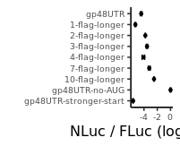

Analyze luminescent data from UL4 uORF2 mutants to create figure S4
================

# Load libraries

``` r
library(plotrix)
library(tidyverse)
library(rasilabRtemplates)
```

# Read in data

``` r
counts <- read_csv("../rawdata/20220407_fluc_nluc.csv") %>%
  print()
```

    ## # A tibble: 114 × 3
    ##    well  assay counts
    ##    <chr> <chr>  <dbl>
    ##  1 B2    fluc      32
    ##  2 B3    fluc    4830
    ##  3 B4    fluc   13618
    ##  4 B5    fluc    6739
    ##  5 B6    fluc   12705
    ##  6 B7    fluc   14956
    ##  7 B8    fluc   20605
    ##  8 B9    fluc   20144
    ##  9 B10   fluc   14608
    ## 10 B11   fluc   15753
    ## # … with 104 more rows
    ## # ℹ Use `print(n = ...)` to see more rows

# Read in annotations

``` r
annotations <- read_csv("../annotations/sampleannotations.csv") %>%
  print()
```

    ## # A tibble: 57 × 6
    ##    well  reporter label                  replicate P22A  label_order
    ##    <chr> <chr>    <chr>                      <dbl> <chr>       <dbl>
    ##  1 B2    mock     mock                           1 <NA>           NA
    ##  2 B3    pASHS64  gp48UTR                        1 <NA>           11
    ##  3 B4    pTBHS1   gp48UTR-no-stall               1 <NA>            2
    ##  4 B5    pTBHS2   gp48UTR-no-AUG                 1 <NA>            3
    ##  5 B6    pTBHS3   gp48UTR-stronger-start         1 <NA>            1
    ##  6 B7    pHPHS579 1-flag-longer                  1 <NA>           10
    ##  7 B8    pHPHS580 2-flag-longer                  1 <NA>            9
    ##  8 B9    pHPHS581 3-flag-longer                  1 <NA>            8
    ##  9 B10   pHPHS582 4-flag-longer                  1 <NA>            7
    ## 10 B11   pHPHS583 7-flag-longer                  1 <NA>            6
    ## # … with 47 more rows
    ## # ℹ Use `print(n = ...)` to see more rows

# Join data with annotations, normalize NLuc by FLuc, calculate mean and error

``` r
data <- counts %>% 
  pivot_wider(names_from = assay, values_from = counts) %>%
  left_join(annotations, by = "well") %>%
  mutate(fluc = fluc - mean(fluc[reporter == "mock"]), nluc = nluc - mean(nluc[reporter == "mock"])) %>%
  filter(label != "mock") %>% 
  mutate(ratio = log2(nluc) - log2(fluc)) %>% 
  group_by(reporter) %>% 
  mutate(mean_ratio = mean(ratio), se_ratio = std.error(ratio)) %>%
  slice(1) %>% 
  ungroup() %>% 
  select(-well, -fluc, -nluc, -ratio, -replicate) %>%
  mutate(label = fct_reorder(label, label_order)) %>%
  print()
```

    ## # A tibble: 18 × 6
    ##    reporter label                             P22A  label_order mean_r…¹ se_ra…²
    ##    <chr>    <fct>                             <chr>       <dbl>    <dbl>   <dbl>
    ##  1 pASHS64  gp48UTR                           <NA>           11     5.85  0.101 
    ##  2 pHPHS579 1-flag-longer                     <NA>           10     4.97  0.0723
    ##  3 pHPHS580 2-flag-longer                     <NA>            9     6.47  0.0295
    ##  4 pHPHS581 3-flag-longer                     <NA>            8     6.72  0.104 
    ##  5 pHPHS582 4-flag-longer                     <NA>            7     6.18  0.193 
    ##  6 pHPHS583 7-flag-longer                     <NA>            6     7.06  0.139 
    ##  7 pHPHS584 10-flag-longer                    <NA>            5     7.78  0.0511
    ##  8 pTBHS1   gp48UTR-no-stall                  <NA>            2    NA    NA     
    ##  9 pTBHS12  GAPDH GACACC stop before uORF2    no              2     7.19  0.0530
    ## 10 pTBHS13  GAPDH GACACC stop before uORF2    yes             2     8.84  0.0348
    ## 11 pTBHS2   gp48UTR-no-AUG                    <NA>            3    10.3   0.0616
    ## 12 pTBHS23  GAPDH no start stop before uORF2  no              1     7.58  0.596 
    ## 13 pTBHS24  GAPDH no start stop before uORF2  yes             1    NA    NA     
    ## 14 pTBHS3   gp48UTR-stronger-start            <NA>            1     4.63  0.0532
    ## 15 pTBHS58  GAPDH GACACC 2 eYFP codons longer no              4     7.16  0.0430
    ## 16 pTBHS59  GAPDH GACACC 2 eYFP codons longer yes             4     8.81  0.0142
    ## 17 pTBHS60  GAPDH no AUG 2 eYFP codons longer no              3     6.20  0.0484
    ## 18 pTBHS61  GAPDH no AUG 2 eYFP codons longer yes             3    NA    NA     
    ## # … with abbreviated variable names ¹​mean_ratio, ²​se_ratio

# Plot FLuc / NLuc

``` r
plot_data <- data %>%
  filter(reporter %in% c("pASHS64", "pTBHS2", "pTBHS3", "pHPHS579", "pHPHS580", "pHPHS581", "pHPHS582", "pHPHS583", "pHPHS584")) %>%
  mutate(mean_ratio = mean_ratio - mean_ratio[label=="gp48UTR-no-AUG"]) %>%
  print()
```

    ## # A tibble: 9 × 6
    ##   reporter label                  P22A  label_order mean_ratio se_ratio
    ##   <chr>    <fct>                  <chr>       <dbl>      <dbl>    <dbl>
    ## 1 pASHS64  gp48UTR                <NA>           11      -4.42   0.101 
    ## 2 pHPHS579 1-flag-longer          <NA>           10      -5.30   0.0723
    ## 3 pHPHS580 2-flag-longer          <NA>            9      -3.80   0.0295
    ## 4 pHPHS581 3-flag-longer          <NA>            8      -3.54   0.104 
    ## 5 pHPHS582 4-flag-longer          <NA>            7      -4.09   0.193 
    ## 6 pHPHS583 7-flag-longer          <NA>            6      -3.21   0.139 
    ## 7 pHPHS584 10-flag-longer         <NA>            5      -2.49   0.0511
    ## 8 pTBHS2   gp48UTR-no-AUG         <NA>            3       0      0.0616
    ## 9 pTBHS3   gp48UTR-stronger-start <NA>            1      -5.64   0.0532

``` r
plot_data %>%
# Plot average nluc/fluc ratios by reporter construct
 ggplot(aes(x = label, y = mean_ratio, ymax = mean_ratio + se_ratio,
            ymin = mean_ratio - se_ratio)) +  
  geom_point(size = 1) +
  geom_errorbar(width = 0.5) +
  labs(y = 'NLuc / FLuc (log2, a.u.)',
       x = '') +
  scale_y_continuous(breaks = scales::pretty_breaks(n=4)) +
  coord_flip() +
  theme(axis.text.y = element_text(size = 7), axis.text.x = element_text(size = 7))
```

<!-- -->

``` r
ggsave("../figures/fig_s4.pdf")
```
