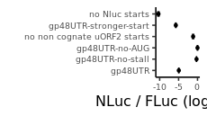

Analyze luminescent data from UL4 uORF2 mutants to create figure S1A
================

# Load libraries

``` r
library(plotrix)
library(tidyverse)
library(rasilabRtemplates)
```

# Read in data

``` r
counts <- read_csv("../rawdata/20220405_fluc_nluc.csv") %>%
  print()
```

    ## # A tibble: 90 × 3
    ##    well  assay counts
    ##    <chr> <chr>  <dbl>
    ##  1 B2    fluc    1252
    ##  2 B3    fluc    6389
    ##  3 B4    fluc    1143
    ##  4 B5    fluc    9256
    ##  5 B6    fluc    8575
    ##  6 B7    fluc    4131
    ##  7 B8    fluc    5081
    ##  8 B9    fluc   10082
    ##  9 B10   fluc   10344
    ## 10 B11   fluc    4503
    ## # … with 80 more rows
    ## # ℹ Use `print(n = ...)` to see more rows

# Read in annotations

``` r
annotations <- read_csv("../annotations/sampleannotations.csv") %>%
  print()
```

    ## # A tibble: 45 × 6
    ##    well  reporter label                             replicate P22A  label_order
    ##    <chr> <chr>    <chr>                                 <dbl> <chr>       <dbl>
    ##  1 B2    pASHS64  gp48UTR                                   1 <NA>            1
    ##  2 B3    pTBHS1   gp48UTR-no-stall                          1 <NA>            2
    ##  3 B4    pTBHS2   gp48UTR-no-AUG                            1 <NA>            3
    ##  4 B5    pTBHS3   gp48UTR-stronger-start                    1 <NA>            5
    ##  5 B6    pTBHS12  GAPDH GACACC stop before uORF2            1 no              2
    ##  6 B7    pTBHS13  GAPDH GACACC stop before uORF2            1 yes             2
    ##  7 B8    pTBHS23  GAPDH no start stop before uORF2          1 no              1
    ##  8 B9    pTBHS24  GAPDH no start stop before uORF2          1 yes             1
    ##  9 B10   pTBHS58  GAPDH GACACC 2 eYFP codons longer         1 no              4
    ## 10 B11   pTBHS59  GAPDH GACACC 2 eYFP codons longer         1 yes             4
    ## # … with 35 more rows
    ## # ℹ Use `print(n = ...)` to see more rows

# Join data with annotations, normalize NLuc by FLuc, calculate mean and error

``` r
data <- counts %>% 
  pivot_wider(names_from = assay, values_from = counts) %>%
  left_join(annotations, by = "well") %>%
  mutate(fluc = fluc - mean(fluc[reporter == "mock"]), nluc = nluc - mean(nluc[reporter == "mock"])) %>%
  filter(label != "mock") %>% 
  mutate(ratio = log2(nluc) - log2(fluc)) %>% 
  group_by(reporter) %>% 
  mutate(mean_ratio = mean(ratio), se_ratio = std.error(ratio)) %>%
  slice(1) %>% 
  ungroup() %>% 
  select(-well, -fluc, -nluc, -ratio, -replicate) %>%
  mutate(label = fct_reorder(label, label_order)) %>%
  print()
```

    ## # A tibble: 14 × 6
    ##    reporter label                             P22A  label_order mean_r…¹ se_ra…²
    ##    <chr>    <fct>                             <chr>       <dbl>    <dbl>   <dbl>
    ##  1 pASHS64  gp48UTR                           <NA>            1  5.38     0.0519
    ##  2 pHPHS577 no Nluc starts                    <NA>            6 -0.00533  0.163 
    ##  3 pHPHS578 no non cognate uORF2 starts       <NA>            4  9.16     0.148 
    ##  4 pTBHS1   gp48UTR-no-stall                  <NA>            2 10.1      0.0243
    ##  5 pTBHS12  GAPDH GACACC stop before uORF2    no              2  7.03     0.120 
    ##  6 pTBHS13  GAPDH GACACC stop before uORF2    yes             2  8.66     0.121 
    ##  7 pTBHS2   gp48UTR-no-AUG                    <NA>            3 10.3      0.0830
    ##  8 pTBHS23  GAPDH no start stop before uORF2  no              1  5.14     0.182 
    ##  9 pTBHS24  GAPDH no start stop before uORF2  yes             1 NA       NA     
    ## 10 pTBHS3   gp48UTR-stronger-start            <NA>            5  4.58     0.0724
    ## 11 pTBHS58  GAPDH GACACC 2 eYFP codons longer no              4  6.74     0.103 
    ## 12 pTBHS59  GAPDH GACACC 2 eYFP codons longer yes             4  8.72     0.263 
    ## 13 pTBHS60  GAPDH no AUG 2 eYFP codons longer no              3  6.16     0.167 
    ## 14 pTBHS61  GAPDH no AUG 2 eYFP codons longer yes             3  9.27     0.0769
    ## # … with abbreviated variable names ¹​mean_ratio, ²​se_ratio

# Plot FLuc / NLuc

``` r
plot_data <- data %>%
  filter(reporter %in% c("pASHS64", "pTBHS1", "pTBHS2", "pTBHS3", "pHPHS577", "pHPHS578")) %>%
  mutate(mean_ratio = mean_ratio - max(mean_ratio)) %>%
  print()
```

    ## # A tibble: 6 × 6
    ##   reporter label                       P22A  label_order mean_ratio se_ratio
    ##   <chr>    <fct>                       <chr>       <dbl>      <dbl>    <dbl>
    ## 1 pASHS64  gp48UTR                     <NA>            1     -4.94    0.0519
    ## 2 pHPHS577 no Nluc starts              <NA>            6    -10.3     0.163 
    ## 3 pHPHS578 no non cognate uORF2 starts <NA>            4     -1.16    0.148 
    ## 4 pTBHS1   gp48UTR-no-stall            <NA>            2     -0.258   0.0243
    ## 5 pTBHS2   gp48UTR-no-AUG              <NA>            3      0       0.0830
    ## 6 pTBHS3   gp48UTR-stronger-start      <NA>            5     -5.74    0.0724

``` r
plot_data %>%
# Plot average nluc/fluc ratios by reporter construct
 ggplot(aes(x = label, y = mean_ratio, ymax = mean_ratio + se_ratio,
            ymin = mean_ratio - se_ratio)) +  
  geom_point(size = 1) +
  geom_errorbar(width = 0.5) +
  labs(y = 'NLuc / FLuc (log2, a.u.)',
       x = '') +
  scale_y_continuous(breaks = scales::pretty_breaks(n=4)) +
  coord_flip() +
  theme(axis.text.y = element_text(size = 7), axis.text.x = element_text(size = 7))
```

<!-- -->

``` r
ggsave("../figures/fig_s1a.pdf")
```
