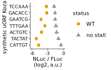
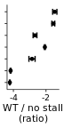

Analyze luminescent data from reduced ribosome loading via a 5’
synthetic uORF to create figure 5C
================

# Load libraries

``` r
library(plotrix)
library(tidyverse)
library(rasilabRtemplates)
```

# Read in data

``` r
counts <- read_tsv("../rawdata/20191021_fluc_nluc.tsv") %>% 
  print()
```

    ## # A tibble: 120 × 3
    ##    well  assay  counts
    ##    <chr> <chr>   <dbl>
    ##  1 B2    nluc     2432
    ##  2 B3    nluc   640617
    ##  3 B4    nluc  4082121
    ##  4 B5    nluc  2221624
    ##  5 B6    nluc    13851
    ##  6 B7    nluc   503005
    ##  7 B8    nluc   694679
    ##  8 B9    nluc  1129426
    ##  9 B10   nluc    54578
    ## 10 B11   nluc   243429
    ## # … with 110 more rows
    ## # ℹ Use `print(n = ...)` to see more rows

# Read in annotations

``` r
annotations <- read_tsv("../annotations/sampleannotations.tsv") %>% 
  print()
```

    ## # A tibble: 60 × 7
    ##    well  reporter label                          replic…¹ status label…² statu…³
    ##    <chr> <chr>    <chr>                             <dbl> <chr>    <dbl>   <dbl>
    ##  1 B2    mock     mock                                  1 <NA>        NA      NA
    ##  2 B3    pASHS64  WT UL4                                1 <NA>        NA      NA
    ##  3 B4    pTBHS1   P22A                                  1 <NA>        NA      NA
    ##  4 B5    pTBHS2   uORF2 no AUG                          1 <NA>        NA      NA
    ##  5 B6    pTBHS3   uORF2 strong Kozak                    1 <NA>        NA      NA
    ##  6 B7    pTBHS12  GAPDH GACACC stop before uORF2        1 WT           2       1
    ##  7 B8    pTBHS13  GAPDH GACACC stop before uORF2        1 no st…       2       2
    ##  8 B9    pTBHS40  K10Q S12P                             1 <NA>        NA      NA
    ##  9 B10   pTBHS41  GAPDH ACTGTC stop before uORF2        1 WT           5       1
    ## 10 B11   pTBHS42  GAPDH CATTGT stop before uORF2        1 WT           7       1
    ## # … with 50 more rows, and abbreviated variable names ¹​replicate, ²​label_order,
    ## #   ³​status_order
    ## # ℹ Use `print(n = ...)` to see more rows

# Join data with annotations, normalize NLuc by FLuc, calculate mean and error. Max normalize (max = no AUG control)

``` r
data <- counts %>% 
  pivot_wider(names_from = assay, values_from = counts) %>%
  left_join(annotations, by = "well") %>%
  mutate(fluc = fluc - mean(fluc[reporter == "mock"]), nluc = nluc - mean(nluc[reporter == "mock"])) %>%
  filter(label != "mock") %>% 
  mutate(ratio = log2(nluc) - log2(fluc)) %>% 
  group_by(reporter) %>%
  mutate(mean_ratio = mean(ratio), se_ratio = std.error(ratio)) %>% 
  slice(1) %>% 
  ungroup() %>% 
  select(-well, -fluc, -nluc, -ratio, -replicate) %>%
  mutate(kozak = str_extract(label, "(?<=GAPDH )[ACTG]{6}")) %>% 
  mutate(kozak = fct_rev(fct_reorder(kozak, label_order))) %>%
  mutate(status = fct_reorder(status, status_order)) %>%
  print()
```

    ## # A tibble: 19 × 8
    ##    reporter label                   status label…¹ statu…² mean_…³ se_ra…⁴ kozak
    ##    <chr>    <chr>                   <fct>    <dbl>   <dbl>   <dbl>   <dbl> <fct>
    ##  1 pASHS64  WT UL4                  <NA>        NA      NA    5.82  0.0445 <NA> 
    ##  2 pTBHS1   P22A                    <NA>        NA      NA    9.28  0.0470 <NA> 
    ##  3 pTBHS12  GAPDH GACACC stop befo… WT           2       1    6.48  0.0905 GACA…
    ##  4 pTBHS13  GAPDH GACACC stop befo… no st…       2       2    8.03  0.0482 GACA…
    ##  5 pTBHS2   uORF2 no AUG            <NA>        NA      NA    9.66  0.0666 <NA> 
    ##  6 pTBHS3   uORF2 strong Kozak      <NA>        NA      NA    4.24  0.0229 <NA> 
    ##  7 pTBHS40  K10Q S12P               <NA>        NA      NA    8.38  0.0476 <NA> 
    ##  8 pTBHS41  GAPDH ACTGTC stop befo… WT           5       1    5.50  0.190  ACTG…
    ##  9 pTBHS42  GAPDH CATTGT stop befo… WT           7       1    4.95  0.0226 CATT…
    ## 10 pTBHS43  GAPDH GAATCG stop befo… WT           3       1    5.39  0.117  GAAT…
    ## 11 pTBHS44  GAPDH TACTAT stop befo… WT           6       1    4.50  0.0267 TACT…
    ## 12 pTBHS45  GAPDH TCCAAA stop befo… WT           1       1    6.41  0.131  TCCA…
    ## 13 pTBHS46  GAPDH TTTGAA stop befo… WT           4       1    6.14  0.0303 TTTG…
    ## 14 pTBHS47  GAPDH ACTGTC stop befo… no st…       5       2    8.36  0.0626 ACTG…
    ## 15 pTBHS48  GAPDH CATTGT stop befo… no st…       7       2    9.17  0.124  CATT…
    ## 16 pTBHS49  GAPDH GAATCG stop befo… no st…       3       2    8.06  0.0433 GAAT…
    ## 17 pTBHS50  GAPDH TACTAT stop befo… no st…       6       2    8.67  0.0204 TACT…
    ## 18 pTBHS51  GAPDH TCCAAA stop befo… no st…       1       2    7.87  0.0749 TCCA…
    ## 19 pTBHS52  GAPDH TTTGAA stop befo… no st…       4       2    8.21  0.0218 TTTG…
    ## # … with abbreviated variable names ¹​label_order, ²​status_order, ³​mean_ratio,
    ## #   ⁴​se_ratio

# Plot Fluc / NLuc

``` r
plot_data <- data %>%
  mutate(mean_ratio = mean_ratio - max(mean_ratio)) %>%
  # select only reporters of interest
  filter(!is.na(label_order)) %>%
  print()
```

    ## # A tibble: 14 × 8
    ##    reporter label                   status label…¹ statu…² mean_…³ se_ra…⁴ kozak
    ##    <chr>    <chr>                   <fct>    <dbl>   <dbl>   <dbl>   <dbl> <fct>
    ##  1 pTBHS12  GAPDH GACACC stop befo… WT           2       1  -3.18   0.0905 GACA…
    ##  2 pTBHS13  GAPDH GACACC stop befo… no st…       2       2  -1.63   0.0482 GACA…
    ##  3 pTBHS41  GAPDH ACTGTC stop befo… WT           5       1  -4.16   0.190  ACTG…
    ##  4 pTBHS42  GAPDH CATTGT stop befo… WT           7       1  -4.71   0.0226 CATT…
    ##  5 pTBHS43  GAPDH GAATCG stop befo… WT           3       1  -4.27   0.117  GAAT…
    ##  6 pTBHS44  GAPDH TACTAT stop befo… WT           6       1  -5.16   0.0267 TACT…
    ##  7 pTBHS45  GAPDH TCCAAA stop befo… WT           1       1  -3.25   0.131  TCCA…
    ##  8 pTBHS46  GAPDH TTTGAA stop befo… WT           4       1  -3.52   0.0303 TTTG…
    ##  9 pTBHS47  GAPDH ACTGTC stop befo… no st…       5       2  -1.30   0.0626 ACTG…
    ## 10 pTBHS48  GAPDH CATTGT stop befo… no st…       7       2  -0.486  0.124  CATT…
    ## 11 pTBHS49  GAPDH GAATCG stop befo… no st…       3       2  -1.60   0.0433 GAAT…
    ## 12 pTBHS50  GAPDH TACTAT stop befo… no st…       6       2  -0.987  0.0204 TACT…
    ## 13 pTBHS51  GAPDH TCCAAA stop befo… no st…       1       2  -1.79   0.0749 TCCA…
    ## 14 pTBHS52  GAPDH TTTGAA stop befo… no st…       4       2  -1.45   0.0218 TTTG…
    ## # … with abbreviated variable names ¹​label_order, ²​status_order, ³​mean_ratio,
    ## #   ⁴​se_ratio

``` r
plot_data %>%
# Plot average nluc/fluc ratios by reporter construct
 ggplot(aes(x = kozak, y = mean_ratio, ymax = mean_ratio + se_ratio, color = status, shape = status,
            ymin = mean_ratio - se_ratio)) +  
  geom_point(size = 2) +
  geom_errorbar(width = 0.5, show.legend = F) +
  labs(y = 'NLuc / FLuc\n(log2, a.u.)',
       x = 'synthetic uORF Kozak') +
  scale_y_continuous(limits = c(-6, 0), breaks = seq(-6, 0, by = 3)) +
  scale_color_manual(values = cbPalette[c(2,1)]) +
  coord_flip() +
  theme(axis.text.y = element_text(size = 7), axis.text.x = element_text(size = 7))
```

<!-- -->

``` r
ggsave("../figures/fig_5c_left.pdf")
```

# Plot Fluc / NLuc

``` r
plot_data <- data %>%
  mutate(mean_ratio = mean_ratio - max(mean_ratio)) %>%
  # select only reporters of interest
  filter(!is.na(label_order)) %>%
  group_by(kozak) %>%
  mutate(se_ratio_test = se_ratio - mean_ratio[status=="no stall"]) %>%
  mutate(mean_ratio = mean_ratio - mean_ratio[status=="no stall"]) %>%
  ungroup() %>%
  filter(status == 'WT') %>%
  print()
```

    ## # A tibble: 7 × 9
    ##   reporter label            status label…¹ statu…² mean_…³ se_ra…⁴ kozak se_ra…⁵
    ##   <chr>    <chr>            <fct>    <dbl>   <dbl>   <dbl>   <dbl> <fct>   <dbl>
    ## 1 pTBHS12  GAPDH GACACC st… WT           2       1   -1.55  0.0905 GACA…   1.72 
    ## 2 pTBHS41  GAPDH ACTGTC st… WT           5       1   -2.86  0.190  ACTG…   1.49 
    ## 3 pTBHS42  GAPDH CATTGT st… WT           7       1   -4.22  0.0226 CATT…   0.509
    ## 4 pTBHS43  GAPDH GAATCG st… WT           3       1   -2.67  0.117  GAAT…   1.71 
    ## 5 pTBHS44  GAPDH TACTAT st… WT           6       1   -4.17  0.0267 TACT…   1.01 
    ## 6 pTBHS45  GAPDH TCCAAA st… WT           1       1   -1.46  0.131  TCCA…   1.92 
    ## 7 pTBHS46  GAPDH TTTGAA st… WT           4       1   -2.07  0.0303 TTTG…   1.48 
    ## # … with abbreviated variable names ¹​label_order, ²​status_order, ³​mean_ratio,
    ## #   ⁴​se_ratio, ⁵​se_ratio_test

``` r
plot_data %>%
# Plot average nluc/fluc ratios by reporter construct
 ggplot(aes(x = kozak, y = mean_ratio, ymax = mean_ratio + se_ratio, ymin = mean_ratio - se_ratio)) +  
  geom_point(size = 1) +
  geom_errorbar(width = 0.5, show.legend = F) +
  labs(y = 'WT / no stall\n(ratio)',
       x = 'synthetic uORF Kozak') +
  scale_y_continuous(breaks = scales::pretty_breaks(n=2)) +
  scale_color_manual(values = cbPalette[c(2,1)]) +
  coord_flip() +
  theme(axis.text.y = element_blank(), axis.text.x = element_text(size = 7), axis.title.y = element_blank())
```

<!-- -->

``` r
ggsave("../figures/fig_5c_right.pdf")
```
